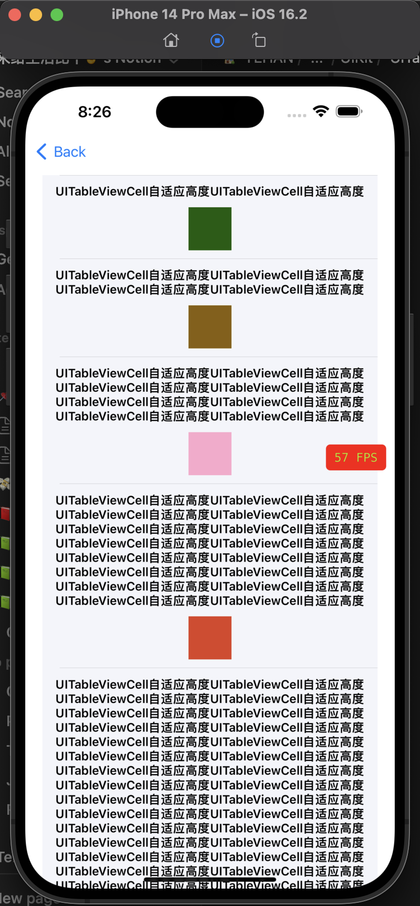

### 1.UITableViewCell高度自适应

### 2.UITableView自适应高度
<video id="video" controls="" preload="none" poster="封面">
      <source id="mp4" src="YHDynamicTableView/imgs/UITableView高度自适应.mp4" type="video/mp4">
</videos>

### 3.UITableViewCell嵌套UITableView
